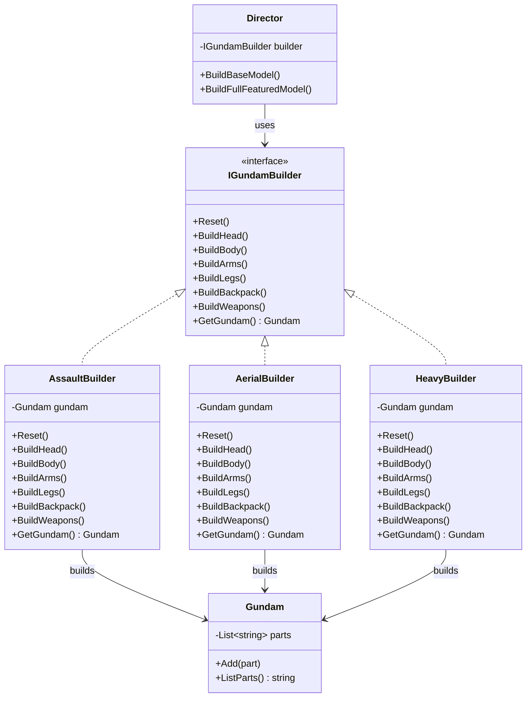

```mermaid
classDiagram

    class Director {
        -IGundamBuilder builder
        +BuildBaseModel()
        +BuildFullFeaturedModel()
    }

    class IGundamBuilder {
        <<interface>>
        +Reset()
        +BuildHead()
        +BuildBody()
        +BuildArms()
        +BuildLegs()
        +BuildBackpack()
        +BuildWeapons()
        +GetGundam() Gundam
    }

    class AssaultBuilder {
        -Gundam gundam
        +Reset()
        +BuildHead()
        +BuildBody()
        +BuildArms()
        +BuildLegs()
        +BuildBackpack()
        +BuildWeapons()
        +GetGundam() Gundam
    }

    class AerialBuilder {
        -Gundam gundam
        +Reset()
        +BuildHead()
        +BuildBody()
        +BuildArms()
        +BuildLegs()
        +BuildBackpack()
        +BuildWeapons()
        +GetGundam() Gundam
    }

    class HeavyBuilder {
        -Gundam gundam
        +Reset()
        +BuildHead()
        +BuildBody()
        +BuildArms()
        +BuildLegs()
        +BuildBackpack()
        +BuildWeapons()
        +GetGundam() Gundam
    }

    class Gundam {
        -List~string~ parts
        +Add(part)
        +ListParts() string
    }

    Director --> IGundamBuilder : uses

    IGundamBuilder <|.. AssaultBuilder
    IGundamBuilder <|.. AerialBuilder
    IGundamBuilder <|.. HeavyBuilder

    AssaultBuilder --> Gundam : builds
    AerialBuilder --> Gundam : builds
    HeavyBuilder --> Gundam : builds
```