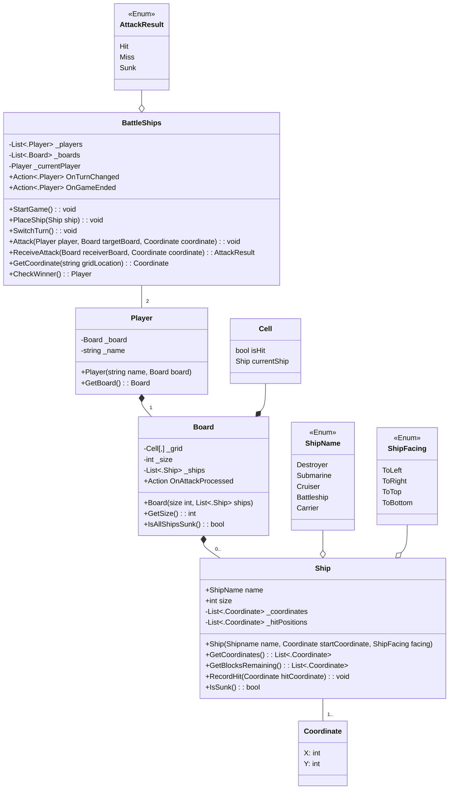

```mermaid

classDiagram
direction TB
    class Coordinate {
	    X: int
	    Y: int
    }

    class Ship {
	    +ShipName name
	    +int size
	    -List~.Coordinate~ _coordinates
	    -List<.Coordinate> _hitPositions
		+Ship(Shipname name, Coordinate startCoordinate, ShipFacing facing)
	    +GetCoordinates() : List<.Coordinate>
		+GetBlocksRemaining() : List<.Coordinate>
		+RecordHit(Coordinate hitCoordinate) : void
	    +IsSunk() : bool
    }

    class ShipName {
	    Destroyer
	    Submarine
	    Cruiser
	    Battleship
	    Carrier
    }

	class ShipFacing {
	    ToLeft
	    ToRight
	    ToTop
	    ToBottom
    }

    class Player {
	    -Board _board
	    -string _name
		+Player(string name, Board board)
	    +GetBoard() : Board
    }

    class Board {
	    -Cell[,] _grid
	    -int _size
	    -List~.Ship~ _ships
		+Action<Coordinate, AttackResult> OnAttackProcessed
		+Board(size int, List<.Ship> ships)
	    +GetSize() : int
	    +IsAllShipsSunk() : bool
    }

    class AttackResult {
	    Hit
	    Miss
	    Sunk
    }

    class Cell {
	    bool isHit
	    Ship currentShip
    }

    class BattleShips {
	    -List<.Player> _players
	    -List<.Board> _boards
	    -Player _currentPlayer
		+Action<.Player> OnTurnChanged
		+Action<.Player> OnGameEnded
	    +StartGame() : void
      	+PlaceShip(Ship ship) : void
	    +SwitchTurn() : void
      	+Attack(Player player, Board targetBoard, Coordinate coordinate) : void
	    +ReceiveAttack(Board receiverBoard, Coordinate coordinate) : AttackResult
      	+GetCoordinate(string gridLocation) : Coordinate
      	+CheckWinner() : Player
    }

	<<Enum>> ShipName
	<<Enum>> ShipFacing
	<<Enum>> AttackResult

    Player *-- "1" Board
    Board *-- "0.." Ship
    Ship -- "1.." Coordinate
    BattleShips -- "2" Player
    ShipName --o Ship
    ShipFacing --o Ship
    AttackResult --o BattleShips
    Cell --* Board

```

