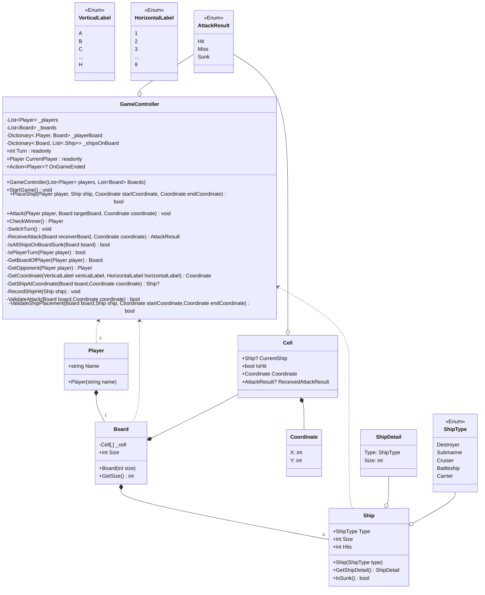

# Battleships Class Diagram by Abam

```mermaid

classDiagram
direction TB
    class ShipDetail {
        Type: ShipType
        Size: int
    }

    class Coordinate {
        X: int
        Y: int
    }

    class Ship {
        +ShipType Type
        +int Size
        +int Hits
        +Ship(ShipType type)
        +GetShipDetail() ShipDetail
        +IsSunk() bool
    }

    class ShipType {
        Destroyer
        Submarine
        Cruiser
        Battleship
        Carrier
    }

    class VerticalLabel {
        A
        B
        C
        ...
        H
    }

    class HorizontalLabel {
        1
        2
        3
        ...
        8
    }

    class Player {
        +string Name
        +Player(string name)
    }

    class Board {
        -Cell[,] _cell
        +int Size
        +Board(int size)
        +GetSize() int
    }

    class AttackResult {
        Hit
        Miss
        Sunk
    }

    class Cell {
        +Ship? CurrentShip
        +bool IsHit
        +Coordinate Coordinate
        +AttackResult? ReceivedAttackResult
    }

    class GameController {
        -List~Player~ _players
        -List~Board~ _boards
        -Dictionary<.Player, Board> _playerBoard
        -Dictionary<.Board, List<.Ship>> _shipsOnBoard
        +int Turn : readonly
        +Player CurrentPlayer : readonly
        +Action~Player~? OnGameEnded
        +GameController(List~Player~ players, List~Board~ Boards)
        +StartGame() void
        +PlaceShip(Player player, Ship ship, Coordinate startCoordinate, Coordinate endCoordinate) bool
        +Attack(Player player, Board targetBoard, Coordinate coordinate) void
        +CheckWinner() Player
        -SwitchTurn() void
        -ReceiveAttack(Board receiverBoard, Coordinate coordinate) AttackResult
        -IsAllShipsOnBoardSunk(Board board) bool
        -IsPlayerTurn(Player player) bool
        -GetBoardOfPlayer(Player player) Board
        -GetOpponent(Player player) Player
        -GetCoordinate(VerticalLabel verticalLabel, HorizontalLabel horizontalLabel) Coordinate
        -GetShipAtCoordinate(Board board,Coordinate coordinate) Ship?
        -RecordShipHit(Ship ship) void
        -ValidateAttack(Board board,Coordinate coordinate) bool
        -ValidateShipPlacement(Board board,Ship ship, Coordinate startCoordinate,Coordinate endCoordinate) bool
    }


    <<Enum>> ShipType
    <<Enum>> AttackResult
    <<Enum>> VerticalLabel
    <<Enum>> HorizontalLabel

    Player *-- "1" Board
    Board *-- "0.." Ship
    Cell *-- Coordinate
    GameController <.. "2" Player
    GameController <.. Board
    GameController <.. Ship
    ShipDetail --o Ship
    ShipType --o Ship
    AttackResult --o GameController
    AttackResult --o Cell
    Cell --* Board
```
