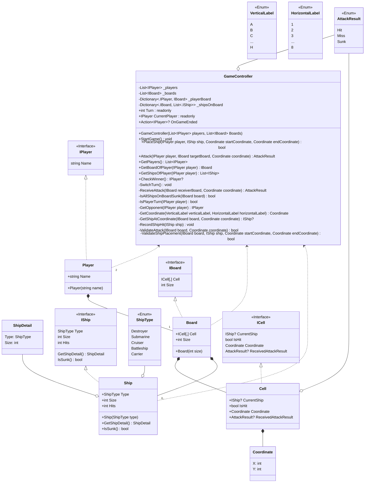

# Battleships Class Diagram by Abam

Gist link [here](https://gist.github.com/Zulfaabam/3662a15e469460f7b8d250cc956b92e5).




```
public int Size => Type switch
{
    ShipType.Destroyer => 2,
    ShipType.Submarine => 3,
    ShipType.Cruiser => 3,
    ShipType.Battleship => 4,
    ShipType.Carrier => 5,
    _ => throw new ArgumentOutOfRangeException()
};
```
